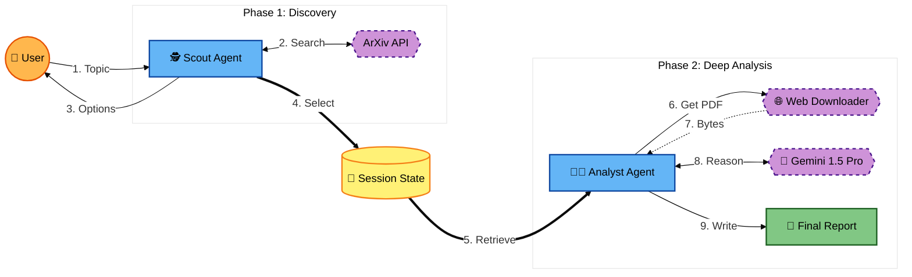

# KagglexGoogle_capstone_project
Research assistant Agent

```mermaid

%%{init: {'theme': 'base', 'themeVariables': { 'primaryColor': '#ffffff', 'edgeLabelBackground':'#ffffff', 'tertiaryColor': '#ffffff'}}}%%

graph LR
    classDef user fill: #FFB74D, stroke: #E65100, stroke-width:2px, color:black, rx:10, ry:10;
    classDef agent fill: #64B5F6, stroke: #0D47A1, stroke-width:2px, color:black;
    classDef tool fill: #CE93D8, stroke: #4A148C,stroke-width:2px, color:black, stroke-dasharray: 5 5;
    classDef db fill: #FFF176, stroke: #F57F17,stroke-width:2px, color:black;
    classDef output fill: #81C784, stroke: #1B5E20, stroke-width: 2px, color:black;

    %% ndoes

    U((👤 User)):::user
    DB[(💾 Session State)]:::db

    subgraph P1 [Phase 1: Discovery]
        direction LR
        Scout[🕵️ Scout Agent]:::agent
        Arxiv{{ArXiv API}}:::tool
    end

    subgraph P2 [Phase 2: Deep Analysis]
        direction LR
        Analyst[👨‍💻 Analyst Agent]:::agent
        Files{{🌐 Web Downloader}}:::tool
        Gemini{{🧠 Gemini 1.5 Pro}}:::tool
        Report[📄 Final Report]:::output
    end

    U ~~~ Scout ~~~ DB ~~~ Analyst

    %% discovery

    U -->|1. Topic| Scout
    Scout <-->|2. Search| Arxiv
    Scout -->|3. Options| U

    %% bridge

    Scout ==>|4. Select| DB
    DB ==>|5. Retrieve| Analyst

    %% analysis internal flow

    Analyst -->|6. Get PDF| Files
    Files -.->|7. Bytes| Analyst
    Analyst <-->|8. Reason| Gemini
    Analyst -->|9. Write| Report
```
