# KagglexGoogle_capstone_project
Research assistant Agent

```mermaid

%%{init: {'theme': 'base', 'themeVariables': { 'primaryColor': '#ffffff', 'edgeLabelBackground':'#ffffff', 'tertiaryColor': '#ffffff'}}}%%

graph LR
    classDef user fill: #FFB74D, stroke: #E65100, stroke-width:2px, color:black, rx:10, ry:10;
    classDef agent fill: #64B5F6, stroke: #0D47A1, stroke-width:2px, color:black;
    classDef tool fill: #CE93D8, stroke: #4A148C,stroke-width:2px, color:black, stroke-dasharray: 5 5;
    classDef db fill: #FFF176, stroke: #F57F17,stroke-width:2px, color:black;
    classDef output fill: #81C784, stroke: #1B5E20, stroke-width: 2px, color:black;

    %% ndoes

    U((👤 User)):::user
    DB[(💾 Session State)]:::db

    subgraph P1 [Phase 1: Discovery]
        direction LR
        Scout[ðŸ•µï¸ Scout Agent]:::agent
        Arxiv{{ArXiv API}}:::tool
    end

    subgraph P2 [Phase 2: Deep Analysis]
        direction LR
        Analyst[👨â€ðŸ’» Analyst Agent]:::agent
        Files{{🌠Web Downloader}}:::tool
        Gemini{{🧠 Gemini 1.5 Pro}}:::tool
        Report[📄 Final Report]:::output
    end

    U ~~~ Scout ~~~ DB ~~~ Analyst

    %% discovery

    U -->|1. Topic| Scout
    Scout <-->|2. Search| Arxiv
    Scout -->|3. Options| U

    %% bridge

    Scout ==>|4. Select| DB
    DB ==>|5. Retrieve| Analyst

    %% analysis internal flow

    Analyst -->|6. Get PDF| Files
    Files -.->|7. Bytes| Analyst
    Analyst <-->|8. Reason| Gemini
    Analyst -->|9. Write| Report
```

**The Problem: Research Overload**

Academic research is that moment in every students' life that comes with a course called *"Advanced search engine usage"*. It's the real-life implementation of the 80-20 rule, where you spend 80% of the time hunting for papers, and only 20% actually using them. Existing LLMs fail at this workflow. Feed a dozen papers into a single prompt and you get "context rot," overflow, and eventually, the model starts hallucinating.

**Our Solution: Research Concierge**

We present a Multi-agent system designed to automate the literature review process (the thousand-stairs path between "I have a research idea" and writing the first word in LaTeX). By decoupling *discovery* from *analysis*, we ensure high-fidelity results without overloading the model's context. By using multiple agents, each given a concrete task, we ensure quality at every step of the process. And lastly, by integrating a HITL, we also ensure the results remain completely under the control of the researcher, with approval of papers being done by the human.

**Key Concepts & Architecture**

Features implemented:

1. **Multi-Agent System (Sequential Agents)**

We utilized a supervisor-worker chain of ~~thought~~ action where agents perform distinct roles in sequence:

Agent 1 (The Scout) is responsible for *broad search* and *filtering*.

Agent 2 (The Analyst) is responsible for *deep reading* and *synthesis*.

This *Sequential Agent Architecture* solves both issues at the same time: On the one hand, the Scout never reads all 100 papers entirely, so it can focus on broad searching. On the other hand, the "Analyst" is not distracted by *search* tasks, but rather deeply reads and analyzes information in the selected papers. This approach ensures a separation of concerns. 

2. **Iterative Tooling for Context Management**

To solve the issue of reading multiple heavy PDFs (150+ pages long) without using a complex "Loop Agent" construct, the Analyst Agent utilizes Looping Tools. 

The Agent iterates through the approved papers by calling its tools repeatedly. For each paper, it fetches the content, creates a summary, saves it, and then calls the tool again for the next paper. This results in a fresh processing step for each document. This approach ensures that the 10th paper is analyzed with the same accuracy as the 1st, and no hallucinations occur between papers (such as the model taking findings from one paper and attributing them to the next).

3. **Sessions & State Management**

We implemented persistent state management using *DatabaseSessionService* (SQLite) as the bridge between agents. The Scout Agent pushes approved paper URLs to the database session state, which acts as a structured queue for the Analyst Agent to retrieve. This functions as a persistent memory bank for the workflow, ensuring that approved research is saved securely between the search phase and the summarization phase.

4. **Tools & Modal Capabilities**

*Built-in Tools*: OpenAlex API integration for retrieving real-time academic data.

*Modal Performance*: We used *Gemini 2.5 Flash*, chosen for its balance of high speed and reasoning capabilities. It processes the text extracted from PDFs efficiently, ensuring that the summarization loop completes rapidly even when handling large batches of academic papers.

**Impact**

This agentic workflow transforms the researcher from a data hunter into an insight architect, reducing the time to review 10 papers from hours to minutes.

