# KagglexGoogle_capstone_project
Research assistant Agent

```mermaid

%%{init: {'theme': 'base', 'themeVariables': { 'primaryColor': '#ffffff', 'edgeLabelBackground':'#ffffff', 'tertiaryColor': '#ffffff'}}}%%

graph LR
    classDef user fill: #FFB74D, stroke: #E65100, stroke-width:2px, color:black, rx:10, ry:10;
    classDef agent fill: #64B5F6, stroke: #0D47A1, stroke-width:2px, color:black;
    classDef tool fill: #CE93D8, stroke: #4A148C,stroke-width:2px, color:black, stroke-dasharray: 5 5;
    classDef db fill: #FFF176, stroke: #F57F17,stroke-width:2px, color:black;
    classDef output fill: #81C784, stroke: #1B5E20, stroke-width: 2px, color:black;

    %% ndoes

    U((👤 User)):::user
    DB[(💾 Session State)]:::db

    subgraph P1 [Phase 1: Discovery]
        direction LR
        Scout[ðŸ•µï¸ Scout Agent]:::agent
        Arxiv{{ArXiv API}}:::tool
    end

    subgraph P2 [Phase 2: Deep Analysis]
        direction LR
        Analyst[👨â€ðŸ’» Analyst Agent]:::agent
        Files{{🌠Web Downloader}}:::tool
        Gemini{{🧠 Gemini 1.5 Pro}}:::tool
        Report[📄 Final Report]:::output
    end

    U ~~~ Scout ~~~ DB ~~~ Analyst

    %% discovery

    U -->|1. Topic| Scout
    Scout <-->|2. Search| Arxiv
    Scout -->|3. Options| U

    %% bridge

    Scout ==>|4. Select| DB
    DB ==>|5. Retrieve| Analyst

    %% analysis internal flow

    Analyst -->|6. Get PDF| Files
    Files -.->|7. Bytes| Analyst
    Analyst <-->|8. Reason| Gemini
    Analyst -->|9. Write| Report
```

**The Problem: Research Overload**

Academic research is that moment in every students' life that comes with a course called *"Advanced search engine usage"*. It's the real-life implementation of the 80-20 rule, where 80% of the time is spent gathering all the existing research, and only 20% actually using it. Existing LLMs fail at this workflow because feeding dozens of papers into a single prompt causes "context rot", context overflow, and eventually, hallucinations.

**Our Solution: Research Concierge**

We present a Multi-agent system designed to automate the literature review process (the thousand-stairs path between "I have a research idea" and writing the first word in LaTeX). By decoupling discovery from analysis, we ensure high-fidelity results without overloading the model's context. By using multiple agents, each with a concrete task, we ensure quality at every step. By integrating a HITL, we also ensure the results remain completely under the command of the researcher.

**Key Concepts & Architecture**

Features implemented:

1. **Multi-Agent System (Sequential Agents)**

We utilized a supervisor-worker chain of ~~thought~~ action where agents perform distinct roles in a strict sequence:

Agent 1 (The Scout) is responsible for broad search and filtering.

Agent 2 (The Analyst) is responsible for deep reading and synthesis.

This *Sequential Agent Architecture* solves both issues at the same time: On the one hand, the Scout never reads all 100 papers entirely, so it can focus on broad searching. On the other hand, the "Analyst" is not distracted by *search* tasks, but rather deeply reads and analyzes information in the selected papers. This approach ensures a separation of concerns. 

2. **Loop Agents for Context Management**

To solve the issue of reading multiple heavy PDFs (150+ pages long), the Analyst Agent uses a Loop agent pattern.

It iterates through the approved papers, and for each one it processes it, creates a summary, saves it, flushes the memory (resulting in a fresh context window), and moves on to the next one. At the end, the results are aggregated. This approach ensures that the 10th paper is analyzed with the *same accuracy* as the 1st, and no hallucinations occur between papers (taking findings of one paper and attributing them to the next).

3. **Sessions & State Management**

We implemented *sessions and state management* (`InMemorySession`) as the bridge between agents. The Scout Agent pushes approved paper URLs to the session state, which acts as a queue for the Analyst Agent to retrieve (the Analyst Agent needs to retrieve the entire paper). This effectively functions as a short-term memory bank of the workflow, a shared state between the Agents.

4. **Tools & Multimodal Capabilities**

*Built-in Tools*: Google Search (via OpenAlex API integration) for retrieving real-time academic data.

*Multimodal Processing*: We used Gemini 3 Pro, the most performant model from Google, with powerful multimodal capabilites and a large context window. It has the native ability to process non-text modalities, passing PDF binaries directly to the model to preserve chart and table data.

**Impact**

This agentic workflow transforms the researcher from a data hunter into an insight architect, reducing the time to review 10 papers from hours to minutes.

